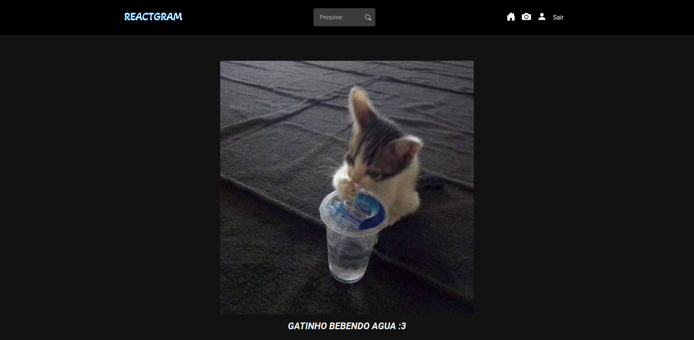

# ReactGram

## Description

Esse é o front-end da aplicação **ReactGram**, Ele é construído em **reactJs**, integração com API usando fetch e gerenciamento de estados utilizando **redux-toolkit**. Para utilizar a plataforma é necessário criar uma conta ou efeituar login em uma conta existente.  
A aplicação possui funcionalidade de like e comentários nas fotos, além de possui responsividade em todas as telas. O projeto foi desenvolvido durante o curso de ReactJs do [@MatheusBattisti](https://www.udemy.com/user/matheus-battisti/).

## Tools

Ferramentas utilizadas no desenvolvimento.

ReactJs  
[@ReactJs](https://www.npmjs.com/package/@reactjs)

Redux Toolkit  
[@Redux-toolkit](https://www.npmjs.com/package/@redux-toolkit)

CSS Module  
[@css-module](https://www.npmjs.com/package/@css-module)

## Contributors

- [@MatheusBattisti](https://github.com/matheusbattisti)
